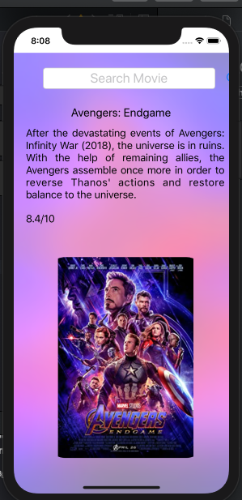
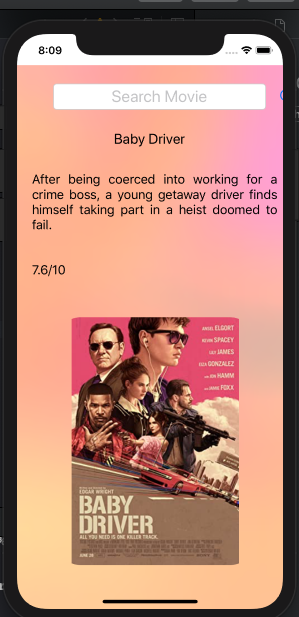

# Created an MovieChecker App using Imdb API (quick look on movie before watching)

## What i've learn

* How to use vector images as image assets.
* Learn to use the UITextField to get user input. 
* Learn about the delegate pattern.
* Swift protocols and extensions. 
* Swift guard keyword. 
* Swift computed properties.
* Swift closures and completion handlers.
* Learn to use URLSession to network and make HTTP requests.
* Parse JSON with the native Encodable and Decodable protocols. 
* Learn to use Grand Central Dispatch to fetch the main thread.
* How to make API request and Display Image wtih Container
